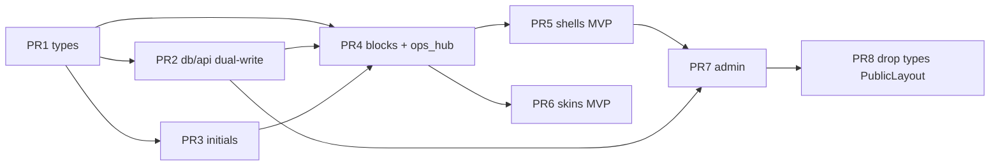

# Homepage Identity Packs: Shells + Skins for Unique Clan Frontends

| Field | Value |
|-------|--------|
| **Document** | Homepage identity packs design |
| **Author** | (draft — platform team) |
| **Date** | 2026-07-12 |
| **Status** | Ready for implementation (design review approved 2026-07-12) |
| **Canonical path** | `docs/superpowers/specs/2026-07-12-homepage-identity-packs-design.md` |
| **Related** | `crates/types/src/org/homepage.rs`, `crates/app/src/pages/home.rs`, `docs/superpowers/specs/2026-06-10-design-revamp-foundation-design.md` |

---

## Overview

Clan platform homepages today share **one front-end shell**. “Templates” (presets in `HomepagePreset`) mainly swap **copy**, **section toggles**, **Hub vs Landing empty-state policy**, and **accent colors**. The result is that every clan site looks like a recolored version of the same command-board page — including a hardcoded **“SC”** watermark and nav mark left over from the flagship tenant (The Scuffed Crew).

This design introduces **identity packs**: a finite set of designed **shells** (composition: section order, hero chrome, teams presentation, **per-section** empty-data policy) plus optional **skins** (visual personality: clean vs esports). Packs also carry the existing preset payload (sections, copy, brand accents). Implementation reuses one renderer built from **shared presentational blocks**, driven by `data-home-shell` / `data-home-skin`, without a CMS or freeform CSS.

**Scope clarity:** packs are **homepage-scoped**. Shells and skins change only the public home page composition and homepage CSS. Nav, footer, and other public pages keep the shared chrome; brand accents remain the only site-wide color override. This is **not** a whole-site reskin (design-revamp SP1 “Clean Editorial everywhere” remains a separate track).

Product naming in this doc is clan-platform-neutral. Crate names stay `scuffed-*` for now; **Scuffed Crew** remains the flagship **opt-in** preset, not the product default.

---

## Background & Motivation

### Current state (verified in tree)

| Area | Location | Behavior today |
|------|----------|----------------|
| Homepage copy + sections | `crates/types/src/org/homepage.rs` | `HomepageContent`, `HomepageSections`, `ContentAlign` |
| Layout mode | `PublicLayout::{Hub, Landing}` | **Per-section** empty policy (see below) — not a single global hide |
| Presets | `HomepagePreset` + `homepage_presets()` | `neutral`, `competitive`, `casual`, `privacy`, `scuffed` |
| Storage | `site_settings.public_layout` + `homepage_json` | String layout (`ASSERT` hub\|landing) + JSON blob |
| Brand | `brand_accent_dark` / `brand_accent_light` | Hex-sanitized in `site-server` routes/settings |
| Page bg | `page_bg_color` / `page_bg_image_url` | Hex + URL sanitizers |
| Public API types | `crates/types/src/org/settings.rs`, `api/settings.rs` | `SiteSettings`, `UpdateSettingsRequest` |
| Admin apply template | `crates/app/src/pages/admin/settings.rs` | Apply preset → optional layout + brand; then Save |
| First-boot | `SetupRequest.homepage_preset` + `site-server/src/routes/auth.rs` | Writes layout, homepage JSON, brand once |
| Renderer | `crates/app/src/pages/home.rs` (~1180 lines) | Single `Home()` + embedded `HOME_CSS` (~780 lines / ~23.5KB) |
| Hardcoded SC | `home.rs` hero `::after { content: 'SC' }` | Watermark always “SC” |
| Nav mark | `crates/app/src/layouts/public.rs` | `div.nav-icon` always renders `"SC"` |
| Public chrome | `layouts::PublicLayout` **component** | Org name text mark; no site logo field |

**Today’s empty-data behavior (important nuance):**

| Section | Hub | Landing |
|---------|-----|---------|
| Schedule / tournaments (Live) | Hide panel when empty | Show empty-state copy |
| News | Hide when empty | Show empty-state copy |
| **Teams** | **Always show** if `sections.teams` (including empty message) | Same |
| Ethos / Recruit | Copy toggles only (`sections.*` + `recruitment_open`) | Same |

**Today’s section order:** Hero → Ethos → Live (schedule ∥ tourneys) → Teams → News → Recruit.

### Pain points

1. **Visual sameness** — composition is fixed; only Hub/Landing and toggles differ.
2. **Product identity leak** — “SC” watermark and nav icon brand every tenant as Scuffed Crew.
3. **Monolithic CSS** — `HOME_CSS` is a single string constant (~780 lines); hard to vary layout without forking the whole file.
4. **`PublicLayout` is underpowered** — it only encodes empty-state policy (and incompletely if thought of as one bool), not composition or visual system.
5. **SaaS readiness** — managed single-tenant instances need a **clean** product default; esports/Scuffed must be opt-in packs.

### Why not a CMS?

Clans need to look distinct quickly. They do **not** need arbitrary HTML, drag-and-drop page builders, or custom CSS uploads (XSS and support burden). A **closed catalog** of shells/skins is the right product surface for v1.

---

## Goals & Non-Goals

### Goals

1. Ship **four shells** with meaningfully different composition and chrome.
2. Support **skins** as a second axis (`clean` product default for non-competitive packs; `esports` for competitive/scuffed and migration of flagship aesthetics).
3. Redefine **template / identity pack** = shell + skin + sections + copy + brand.
4. Keep a **single renderer** composed of shared **presentational** blocks; no N-way fork of `home.rs`.
5. Remove hardcoded **SC** watermark (and nav mark) in favor of **org initials**.
6. Migrate existing installs from `PublicLayout` **without reordering** content on `ops_hub` and without softening flagship esports look by accident.
7. Update admin Settings + first-boot setup to select packs / shell / skin.
8. Preserve security model: no raw user CSS; hex/URL sanitization unchanged; enum allow-lists for shell/skin.

### Non-Goals

- Full block CMS, freeform HTML, or arbitrary section reorder UI beyond shell catalogs.
- Multi-tenant shared database (SaaS remains **instance-per-org**).
- Different **admin** UI skins per clan.
- Infinite custom CSS upload in v1.
- Site-wide logo upload as a hard dependency (nav/hero initials are enough for v1).
- **Whole-site reskin** — homepage composition/skin only; other public pages unchanged except global brand accents (already today).
- Shipping full 4×2 skin matrix as merge-blocking for every shell (see MVP skin cut in PR plan).

---

## Proposed Design

### Conceptual model

```text
Identity pack (preset)
├── shell          → composition + per-section empty policy + section order
├── skin           → visual personality (typography weight, density, chrome motifs)
├── sections       → HomepageSections toggles (existing)
├── content        → HomepageContent copy fields (existing)
└── brand          → suggested accent_dark / accent_light (existing PresetBrand)
```

**v1 does not ship pack-level page background defaults** (`suggested_page_bg_*` deferred). Officers already set page bg in Settings; no empty checkbox in admin for bg-from-pack until a pack actually supplies values.

**Shell** answers: *what is on the page and how is it arranged?*  
**Skin** answers: *how does the homepage feel?* (homepage CSS only)  
**Copy / brand / sections** remain officer-editable after applying a pack.

```mermaid
flowchart TB
  subgraph settings [SiteSettings]
    HS[home_shell]
    SK[home_skin]
    HP[homepage_json → HomepageContent]
    BA[brand_accent_*]
    BG[page_bg_*]
    PL[public_layout derived dual-write]
  end

  subgraph render [Home renderer]
    HOME["Home(): use_resource + HomeCtx"]
    ROOT[".home-wrap data-home-shell data-home-skin"]
    B1[HeroBlock + metrics sub-UI]
    B2[EthosBlock]
    B3[LiveBlock schedule/tourneys]
    B4[TeamsBlock table|cards|compact]
    B5[NewsBlock]
    B6[RecruitBlock]
  end

  HS --> ROOT
  SK --> ROOT
  HOME --> ROOT
  HP --> HOME
  HOME --> B1 & B2 & B3 & B4 & B5 & B6
  HS -->|section order + empty policy + teams variant| HOME
  BA --> ThemeCSS
  BG --> PublicLayoutComponent
```

### Shells (v1 — locked catalog)

| ID | Name | Composition intent | Empty-data (summary) | Teams UI | Maps from today’s presets |
|----|------|--------------------|----------------------|----------|---------------------------|
| `ops_hub` | Ops hub | Dense hero + metrics; **current section order**; roster table; recruit late | Hub-equivalent per-section matrix | Table (`.team-rows`) | competitive, scuffed, **neutral default** |
| `recruit_landing` | Recruit landing | Marketing scroll; **recruit higher**; more whitespace | Landing-equivalent (show empties) | Cards | casual |
| `minimal` | Minimal | Initials + tagline + apply; optional teams strip | Lean hide empties | Compact | shell picker / optional lean path |
| `manifesto` | Manifesto | Ethos-first longform; tourneys de-emphasized | Hybrid (see matrix) | Cards | privacy |

#### Section order (renderer table) — **locked**

Order is **code-defined per shell**, not stored as a freeform list. Section flags still force-hide blocks.

| Order | `ops_hub` (**= current home.rs**) | `recruit_landing` | `minimal` | `manifesto` |
|------:|-----------------------------------|-------------------|-----------|-------------|
| 1 | **Hero** | Hero | Hero | Hero |
| 2 | **Ethos** | Recruit | Teams* | Ethos (primary) |
| 3 | **Live** (schedule ∥ tourneys) | Teams (cards) | Recruit | Recruit |
| 4 | **Teams** (table) | Ethos | — | Teams (cards) |
| 5 | **News** | Live | — | Live* |
| 6 | **Recruit** | News | — | News |

\* `minimal` Teams: only if `sections.teams` **and** (data non-empty **or** policy would show empty — default: **hide** empty teams on minimal).  
\* `manifesto` Live: only if schedule and/or tourneys section flags allow; privacy pack keeps `tournaments: false`.

**Migration parity (K13):** `ops_hub` order is **exactly** today’s order (Hero → Ethos → Live → Teams → News → Recruit). Live-first ops boards are **not** v1; they would be a deliberate product change later, not a silent upgrade.

Hero always renders (metrics are **sub-UI of Hero**, not a `HomeSectionId`). Recruit still respects `recruitment_open`.

#### Empty-data policy API (per-section — not a single bool)

```rust
#[derive(Debug, Clone, Copy, PartialEq, Eq)]
pub enum HomeSectionId {
    Ethos,
    Live,    // schedule + tournaments panels inside one block
    Teams,
    News,
    Recruit,
    // Hero is not a section id — always rendered by Home()
}

impl HomeShell {
    /// Whether a *data-backed* section renders when its data list is empty.
    /// Copy-only sections (Ethos) and Recruit use toggles / recruitment_open instead.
    pub fn show_when_empty(self, section: HomeSectionId) -> bool {
        match (self, section) {
            // --- ops_hub: preserve current Hub behavior ---
            (Self::OpsHub, HomeSectionId::Live) => false,
            (Self::OpsHub, HomeSectionId::News) => false,
            (Self::OpsHub, HomeSectionId::Teams) => true, // always show empty message if toggled
            // --- recruit_landing: preserve current Landing ---
            (Self::RecruitLanding, HomeSectionId::Live) => true,
            (Self::RecruitLanding, HomeSectionId::News) => true,
            (Self::RecruitLanding, HomeSectionId::Teams) => true,
            // --- minimal: lean ---
            (Self::Minimal, HomeSectionId::Live) => false,
            (Self::Minimal, HomeSectionId::News) => false,
            (Self::Minimal, HomeSectionId::Teams) => false, // hide empty teams strip
            // --- manifesto: hybrid ---
            (Self::Manifesto, HomeSectionId::Live) => false, // hide empty live panels
            (Self::Manifesto, HomeSectionId::News) => true,  // show empty board copy
            (Self::Manifesto, HomeSectionId::Teams) => true,
            // Ethos / Recruit: not gated by this API
            (_, HomeSectionId::Ethos | HomeSectionId::Recruit) => true,
        }
    }
}
```

**Live block internal rules** (unchanged from today, parameterized by shell):

- `show_schedule = sections.schedule && (has_events || shell.show_when_empty(Live))`
- `show_tourneys = sections.tournaments && (has_live_tourneys || shell.show_when_empty(Live))`
- Panel grid class: `live-grid` vs `live-grid single` when only one panel shows.
- Section flags force-hide even when data exists (privacy `tournaments: false` is orthogonal to empty policy).

**ops_hub does not start hiding empty teams** — that would be a behavior change for existing hubs. Preserve always-show-empty for teams on `ops_hub` and `recruit_landing`.

#### Shell-specific chrome notes

- **ops_hub** — Parity with current `home.rs`: badge, large display title, metrics in hero, dual live grid, roster table.
- **recruit_landing** — Center-friendly hero (honor `content_align`), larger sub copy, recruit banner moves up; metrics optional/light.
- **minimal** — Short hero, max-width tighter (~36rem), single primary CTA; watermark subtle; no dense live board by default.
- **manifesto** — Ethos rules as long vertical list / pull-quotes; low compete-panel weight; “never ask” privacy box prominent in recruit.

#### Hero secondary CTA policy

Today: secondary CTA is `href: "#squads"` when `sections.teams`.

**v1 rules:**

1. Secondary CTA renders only if the Teams block **will render** for this request (section flag on **and** not suppressed by empty-hide policy for that shell).
2. Target remains `#squads` (stable `id` on Teams block root) whenever Teams renders, regardless of section order.
3. If Teams will not render but Recruit will: optional secondary → `#recruit` (or hide secondary and keep only primary Apply). Prefer **hide secondary** when neither target exists (recruitment closed and teams off).
4. Primary CTA stays Apply when `recruitment_open`.

### Skins (visual)

| ID | Name | Role |
|----|------|------|
| `clean` | Clean | **Product default for non-competitive packs.** Calmer radii, less glow, restrained motion (homepage only). |
| `esports` | Esports | Competitive DNA: clipped badges, accent stroke titles, denser metrics — **current** homepage CSS feel. |

**v1 shipping strategy (locked MVP cut):**

| Shell | Skin CSS in v1 merge criteria |
|-------|-------------------------------|
| `ops_hub` | **Both** `esports` (default look for competitive path; ≈ current CSS) and `clean` |
| `recruit_landing` | **Both** `clean` (default) and `esports` (optional officer pick) |
| `minimal` | **`clean` only** as authored CSS; if `home_skin=esports`, inherit clean shell geometry + esports token accents only (no full motif set) |
| `manifesto` | **`clean` only** as authored CSS; same fallback if esports selected |

- Persist `home_skin` always (enum field), even when a shell has limited CSS — avoids a second migration.
- Default skin on **new** pack apply: `clean` for neutral/casual/privacy; `esports` for competitive/scuffed.
- **Do not** require 4×2 full visual polish + light/dark screenshots for every combo before merge. **Do** require acceptance criteria below.

**Acceptance criteria (per shell, merge-blocking for that shell’s PR):**

1. Screenshot: empty-ish data (no events/tourneys/news as relevant).
2. Screenshot: populated data.
3. No hardcoded “SC”; initials visible.
4. `data-home-shell` / `data-home-skin` present on root.
5. Light + dark: no broken contrast on hero title / CTAs (spot check, not full matrix).

**CSS size budget:** target total homepage CSS constants ≤ **~30KB** source (shared tokens first; shell overrides thin). Shared structural rules live once; skins override badge/title/glow only.

```css
.home-wrap[data-home-shell="ops_hub"][data-home-skin="esports"] { … }
.home-wrap[data-home-shell="ops_hub"][data-home-skin="clean"] { … }
```

Skins **must not** change section order. Skins may tweak spacing, borders, type scale, decorative pseudo-elements, and badge geometry.

### Renderer architecture

#### Do not fork `home.rs`

Split into modules under `crates/app/src/pages/home/`:

```text
crates/app/src/pages/home/
  mod.rs           # Home(): use_resource fetches, resolve shell/skin, build HomeCtx, compose
  blocks.rs        # Presentational: Hero, Ethos, Live, Teams, News, Recruit
  shell.rs         # section_order, show_when_empty, teams_presentation, cta helpers
  css.rs           # HOME_SHARED_CSS + shell_* + skin_* constants
```

Dioxus inlines CSS via `style { {CONST} }` (same as today). No new bundler pipeline for v1.

#### Block boundaries (normative)

| Layer | Owns | Must not |
|-------|------|----------|
| **`Home()`** | All `use_resource` / `use_server_future` fetches (settings, overview, events, tournaments, announcements); resolve `home_shell` / `home_skin`; build `HomeCtx`; iterate `section_order`; inject CSS + root attrs | Embed large markup for each section inline long-term |
| **Blocks** | Pure-ish presentational components: props from `HomeCtx` + resolved lists; local formatting only | Call `ApiClient`, own `use_resource`, or re-fetch |
| **`LiveBlock`** | One block: internal schedule + tourneys panels, grid single/dual class, empty copy | Split into two top-level section ids |
| **Hero** | Title, badge, CTAs, **metrics strip** (squads/members/games counts) | Metrics are **not** a `HomeSectionId` and do not appear in `section_order` |
| **Teams** | `id="squads"` on root when rendered; presentation table\|cards\|compact | Change empty policy (reads shell via ctx) |

```rust
// crates/types — shell policy only (no page-local DTOs)
pub enum HomeSectionId { Ethos, Live, Teams, News, Recruit }
pub enum TeamsPresentation { Table, Cards, Compact }
// HomeShell::section_order / show_when_empty / teams_presentation live here
// org_initials() lives here (pure)

// crates/app/src/pages/home/ — page-local only
// OverviewTeam, Event, HomeTournament, Announcement stay private to the home module
// (as today in home.rs). Do not promote them to types unless a second consumer appears.

pub struct HomeCtx<'a> {
    pub content: &'a HomepageContent,
    pub shell: HomeShell,
    pub skin: HomeSkin,
    pub org_name: &'a str,
    pub initials: String,
    pub recruitment_open: bool,
    // Resolved slices, not Resource handles — Home() reads resources first
    pub teams: Option<&'a [OverviewTeam]>,
    pub games: Option<&'a [OverviewGame]>,
    pub member_count: usize,
    pub events: &'a [Event],
    pub live_tournaments: &'a [HomeTournament],
    pub announcements: &'a [Announcement],
}
```

```rust
// crates/app/src/pages/home/mod.rs (sketch)
// 1) resources in Home()
// 2) let ctx = HomeCtx { … };
// 3) compose:
rsx! {
    style { {HOME_SHARED_CSS} }
    style { {shell_css(shell)} }
    style { {skin_css(shell, skin)} }  // may no-op extra motifs for minimal/manifesto
    div {
        class: "home-wrap",
        "data-home-shell": "{shell.as_str()}",
        "data-home-skin": "{skin.as_str()}",
        div { class: "{home_class}",
            HeroBlock { ctx: /* … */ }
            for id in shell.section_order() {
                { render_section(id, &ctx) }
            }
        }
    }
}
```

`section_order()` returns only `HomeSectionId` values (not Hero). Hero is always first, outside the loop (or the loop starts after an explicit Hero call — either is fine; **do not** put metrics as a separate ordered section).

#### Watermark / initials (must ship)

Place **`org_initials` in `crates/types`** (pure function, unit-tested without WASM), used by app hero + nav.

```rust
// crates/types/src/org/branding.rs (or homepage.rs)
/// Up to 2 uppercase chars for nav/hero marks. Decorative only.
pub fn org_initials(org_name: &str) -> String {
    let cleaned: String = org_name
        .chars()
        .map(|c| if c.is_alphanumeric() || c.is_whitespace() { c } else { ' ' })
        .collect();
    let parts: Vec<&str> = cleaned
        .split_whitespace()
        .filter(|p| !p.eq_ignore_ascii_case("the") && !p.is_empty())
        .collect();
    let raw = match parts.as_slice() {
        [] => "CL".to_string(),
        [one] => one.chars().take(2).collect(),
        [a, b, ..] => [a.chars().next(), b.chars().next()]
            .into_iter()
            .flatten()
            .collect(),
    };
    let mut out: String = raw.chars().take(2).collect::<String>().to_uppercase();
    if out.is_empty() {
        out = "CL".into();
    }
    out
}
```

Notes:

- Cap length at 2; strip leading/trailing punctuation via alphanumeric filter; skip “the”.
- Emoji-only names → fallback `"CL"` (no alphanumeric parts).
- Multi-byte first chars: `chars().next()` is acceptable; no grapheme-cluster crate required in v1.
- Hero: `div { class: "home-hero-mark", aria_hidden: "true", "{initials}" }` (decorative).
- Nav: replace `"SC"` in `.nav-icon` with initials; **keep** adjacent `nav-mark-text` with full `org_name` (accessible name).

Same helper for both call sites. Future `logo_url` plugs into the same slots — out of scope.

### Data model changes

#### Preferred storage

| DB field | Type | Default | Notes |
|----------|------|---------|-------|
| `home_shell` | string | `'ops_hub'` | snake_case; optional `ASSERT` allow-list |
| `home_skin` | string | `'clean'` | snake_case; optional `ASSERT` allow-list |
| `public_layout` | string | `'hub'` | **Retained one release** with existing `ASSERT $value IN ['hub', 'landing']`; **dual-written** as derived mirror |

#### Normative compatibility: dual-write for one release (K14)

Implementers **must** follow this — not optional:

1. **Canonical fields:** `home_shell`, `home_skin`.
2. **On every write** of settings (admin PUT, setup, seed, one-shot migration):  
   - persist `home_shell` / `home_skin`;  
   - **also** set `public_layout` derived:
     - `ops_hub` | `minimal` → `"hub"`
     - `recruit_landing` | `manifesto` → `"landing"`  
   so old binaries that only read `public_layout` keep a sensible Hub/Landing empty policy.
3. **GET** returns **both** `home_shell`/`home_skin` and derived `public_layout` (read-only derivation if fields empty; see backfill execution).
4. **PUT** accepts `home_shell`/`home_skin` (preferred). If only deprecated `public_layout` is sent (old client), map Hub→`ops_hub`, Landing→`recruit_landing` and leave skin unchanged unless also provided.
5. **App** prefers `home_shell`/`home_skin`; ignores layout for composition once upgraded.
6. **PR8** drops `public_layout` column + types enum **after soak** — not in the same PR as introduction.

Do **not** remove dual-write in the introducing PR. Rollback of the app to a pre-shell binary remains viable while `public_layout` stays populated.

**Dual-write limitation (lossy Hub/Landing):** Derived Hub/Landing cannot express manifesto’s hybrid empty policy (`show_when_empty(Live) = false` while Landing-like for news). Lagging pre-shell binaries that only honor `public_layout=landing` may **show empty live panels** for manifesto tenants until upgraded. One-release window only; not a security issue.

#### Migration / backfill rules (shell + skin)

On first read when `home_shell` is missing/empty (or one-shot migration):

| Condition | `home_shell` | `home_skin` |
|-----------|--------------|-------------|
| `public_layout == "landing"` | `recruit_landing` | see skin rules |
| else (`hub` / missing) | `ops_hub` | see skin rules |

**Skin backfill (normative — not “optional heuristic”):**

Product purple (`#8f73ff` / `#6d4aff`) is shared by **neutral** and **scuffed** presets (`homepage.rs`). **Purple alone must never imply `esports`.**

Apply rules **in order**; first match wins:

| Priority | Condition | → `home_skin` |
|----------|-----------|----------------|
| 1 | **Scuffed content markers:** `hero_title` equals/contains `"The Scuffed"` or `"Scuffed"` (case-insensitive), **or** `footer_note` contains `"Scuffed Crew"` | `esports` |
| 2 | **Competitive brand:** `brand_accent_dark` or `brand_accent_light` normalizes to **`#38bdf8`** or **`#0284c7`** (competitive pack cyan) | `esports` |
| 3 | Optional reinforcement only with (1): seeking tags look like scuffed demo (`OW2`, etc.) — **never** with purple brand alone | (already `esports` from 1) |
| 4 | Else (including product purple `#8f73ff`/`#6d4aff` with neutral/generic copy, casual green, privacy violet, empty brand) | **`clean`** |

```text
Preset brand reference (homepage.rs):
  neutral      #8f73ff / #6d4aff  → clean  (product purple; NOT esports)
  scuffed      #8f73ff / #6d4aff  → esports via content markers, not purple
  competitive  #38bdf8 / #0284c7  → esports via competitive brand
  casual       #46d8a4 / #0ea66e  → clean
  privacy      #c084fc / #9333ea  → clean
```

**Backfill execution (prefer one-shot, not public GET write-back):**

1. **Primary:** one-shot data migration in PR2 (migration hook / startup migrate once / explicit Surreal update in `migrations.rs` data step if available). Derive shell+skin for rows missing `home_shell`/`home_skin` (or empty), dual-write `public_layout`, then mark done.
2. **Do not** make public `GET /api/settings` a mutating path by default. Public GET stays **read-only** for derivation: compute shell/skin in the response mapping when fields are empty, **without** writing.
3. **Optional secondary repair:** fire-and-forget write only from **admin PUT**, **setup**, or a **dev/admin-only** repair helper — never fail a public GET if a background repair is attempted; log once on failure.
4. Seed and setup **always** set shell+skin explicitly (never rely on defaults alone for scuffed/competitive).

Operator recovery: re-apply competitive/scuffed identity pack — secondary path, not primary mitigation.

#### Types / API surface

```rust
pub struct SiteSettings {
    // …
    pub home_shell: HomeShell,
    pub home_skin: HomeSkin,
    /// Deprecated mirror for one release; derived from home_shell on write.
    pub public_layout: PublicLayout,
    pub homepage: HomepageContent,
    // brand + bg unchanged
}

pub struct UpdateSettingsRequest {
    pub home_shell: Option<HomeShell>,
    pub home_skin: Option<HomeSkin>,
    /// Deprecated: accepted if shell omitted; maps Hub/Landing → shell.
    pub public_layout: Option<PublicLayout>,
    // …
}

pub struct HomepagePreset {
    pub id: &'static str,
    pub name: &'static str,
    pub description: &'static str,
    pub suggested_shell: HomeShell,  // replaces suggested_layout
    pub suggested_skin: HomeSkin,
    pub suggested_brand: PresetBrand,
    // no suggested_page_bg_* in v1
    pub content: HomepageContent,
}
```

#### Preset mapping (v1)

| Preset id | Shell | Skin | Notes |
|-----------|-------|------|-------|
| `neutral` | `ops_hub` | `clean` | Product-neutral default; **accept denser board when empty** (matches current Hub) |
| `competitive` | `ops_hub` | `esports` | Structure-first |
| `casual` | `recruit_landing` | `clean` | Warm landing |
| `privacy` | `manifesto` | `clean` | Tourneys section off |
| `scuffed` | `ops_hub` | `esports` | Flagship copy + purple; opt-in |

No new `lean` preset required in v1; officers pick shell `minimal` in admin if desired.

**Default decision (K16):** DB defaults `home_shell=ops_hub` + `home_skin=clean` match neutral and current Hub installs. We **do not** switch neutral to `minimal` in v1 — empty ops_hub already hides empty live/news; remaining weight is acceptable and avoids surprising existing hubs. Revisit if SaaS onboarding feedback wants emptier first paint.

#### DB migration (SurrealDB v3)

```sql
DEFINE FIELD OVERWRITE home_shell ON site_settings TYPE string DEFAULT 'ops_hub'
    ASSERT $value IN ['ops_hub', 'recruit_landing', 'minimal', 'manifesto'];
DEFINE FIELD OVERWRITE home_skin ON site_settings TYPE string DEFAULT 'clean'
    ASSERT $value IN ['clean', 'esports'];
-- keep existing:
-- public_layout … ASSERT $value IN ['hub', 'landing']
```

If ASSERT on new fields is awkward for rolling back partial deploys, free strings + **strict API validation** is acceptable; document the choice in the migration PR. Prefer ASSERT to match `public_layout` style.

API write path:

- Serde enums: unknown values → 422/400 (strict on PUT).
- DB read: `from_str_lossy` for junk/partial rows → `OpsHub` / `Clean`.
- `update_settings` normalizes shell/skin allow-list before write (mirror today’s hub/landing clamp).

`Database::update_settings` gains `home_shell` / `home_skin` params and **always** derives `public_layout` when shell is set.

### Admin UI changes

In `crates/app/src/pages/admin/settings.rs`:

1. **Replace** “Layout mode” Hub/Landing with:
   - **Homepage shell** — 4 options + short descriptions.
   - **Homepage skin** — Clean / Esports (note: minimal/manifesto may look mostly clean until full motifs exist).
2. **Identity pack** apply card (rename Template):
   - Checkbox: **Also set shell & skin** (replaces “Also set layout”).
   - Checkbox: **Also set brand accents** (existing).
   - **No** “page background defaults” checkbox in v1 (no pack supplies bg values).
3. Section toggles + copy editors unchanged.
4. Toast: `Applied “Casual community” — click Save to persist.`

**PR7 checklist:** wire load/save of shell/skin; apply pack sets shell+skin+content(+brand); setup descriptions mention shell · skin.

Setup page: preset dropdown only (pack implies shell+skin). No separate shell picker required on setup.

### CSS migration plan

| Phase | Action |
|-------|--------|
| P0 | DOM initials; delete `content: 'SC'`; nav icon initials |
| P1 | `data-home-*` attrs; shared CSS still works for ops_hub |
| P2 | Split shared vs shell vs skin constants; token variables first |
| P3 | recruit_landing / minimal / manifesto composition + teams variants |

Prefer attribute selectors over BEM explosion.

### Sequence: apply pack → save → render

```mermaid
sequenceDiagram
  participant Admin
  participant SPA as AdminSettings
  participant API as PUT /api/settings
  participant DB as site_settings
  participant Home as Home page

  Admin->>SPA: Select identity pack "privacy"
  Admin->>SPA: Apply (shell+skin+brand)
  SPA->>SPA: signals updated locally
  Admin->>SPA: Save Settings
  SPA->>API: home_shell=manifesto, home_skin=clean, homepage, brand
  API->>API: validate shell/skin enums; sanitize accents/bg
  API->>DB: home_shell, home_skin, public_layout=landing (derived)
  DB-->>API: SiteSettings
  API-->>SPA: OK + toast
  Home->>API: GET /api/settings
  Home->>Home: resources → HomeCtx → blocks
```

---

## API / Interface Changes

### GET `/api/settings` (public)

```json
{
  "home_shell": "ops_hub",
  "home_skin": "esports",
  "public_layout": "hub",
  "homepage": { },
  "brand_accent_dark": "#8f73ff"
}
```

Both shell/skin and `public_layout` returned for one release.

### PUT `/api/settings` (admin)

```rust
pub home_shell: Option<HomeShell>,
pub home_skin: Option<HomeSkin>,
pub public_layout: Option<PublicLayout>, // deprecated alias
```

Validation: strict enums on write; no user CSS fields.

On successful update, audit via existing `audit(..., details)` — pass a short details string, e.g. `home_shell=ops_hub home_skin=esports` (API already supports `details: Option<&str>`).

### Setup / seed

`homepage_preset` resolution writes `suggested_shell`, `suggested_skin`, content, brand, and derived `public_layout`. Seed scuffed pack: **`ops_hub` + `esports`** always explicit.

### App client

`AdminSettings` and `Home()` use `home_shell` / `home_skin`.

---

## Data Model Changes

### Schema

See migration SQL above. Retain `public_layout` ASSERT until PR8.

### Migration strategy

1. Deploy code that **reads** shell/skin with fallback + disambiguated skin backfill (content markers + competitive cyan; **not** product purple alone).
2. **One-shot migration** (PR2) writes shell/skin/`public_layout` for legacy rows. Public GET remains read-only (in-memory derive if needed until migration runs).
3. Admin/setup/seed always write canonical + derived.
4. PR8: remove `scuffed_types::PublicLayout` **enum** and DB column after soak — **keep** `crate::layouts::PublicLayout` **component**.

### Risk: long `update_settings` signature

Add two params + derive layout; optional `SettingsPatch` later.

---

## Alternatives Considered

### A. Keep single shell; only more presets  
Rejected — fails uniqueness goal.

### B. Full page builder / CMS  
Rejected — XSS, support, scope.

### C. Fork `home.rs` per shell  
Rejected — maintenance.

### D. Skin-only without shells  
Rejected as sole approach; skins remain second axis.

### E. Shell only inside `homepage_json`  
Rejected — top-level fields match `public_layout` precedent.

### F. Custom CSS field  
Rejected — security/support.

### G. Live-first `ops_hub` order in v1  
Rejected for migration safety; today’s Ethos-early order is locked for `ops_hub`.

### H. Immediate drop of `public_layout` (no dual-write)  
Rejected for one release — breaks rollback and any lagging binary.

**Chosen:** Finite shells + skins + shared presentational blocks + top-level fields + **dual-write** compatibility + identity packs as preset superstructure.

---

## Security & Privacy Considerations

| Threat | Mitigation |
|--------|------------|
| CSS injection via colors | Existing hex sanitizers |
| CSS injection via bg image URL | Existing URL char reject |
| Shell/skin injection | Enum allow-list + optional DB ASSERT; never interpolate unknown strings into CSS |
| Custom CSS upload | Non-goal |
| XSS in homepage copy | Dioxus escaped text nodes |
| Logo URL (future) | Same as `page_bg_image_url` |

---

## Observability

**v1 required:**

- `tracing` on PUT `/api/settings` with fields `home_shell`, `home_skin` (and org id if available).
- Audit: existing `AuditAction::UpdatedSettings`; pass `details` string including shell and skin (helper already accepts `Option<&str>`).

**Deferred:** metrics counters / histograms (no metrics stack assumed).

---

## Rollout Plan

### Feature flags

None required; defaults + dual-write keep pages working.

### Stages

1. Types + DB + API dual-write + one-shot migration backfill (content/cyan skin rules; not product purple).
2. De-Scuff initials (hero + nav).
3. Home module split + ops_hub parity (order + empty matrix + esports CSS).
4. Remaining shells + teams variants; MVP skin cut.
5. Admin/setup identity packs.
6. Soak → remove `PublicLayout` enum + column (not the layout component).

### Rollback

- Old app binary: still reads `public_layout` (kept dual-written to hub/landing).
- New fields ignored by old app if unknown JSON fields are ignored by serde defaults on old structs — prefer keeping `public_layout` populated always during dual-support window.
- Do not drop `public_layout` ASSERT/column until PR8.

### Risks

| Risk | Sev | Mitigation |
|------|-----|------------|
| Visual regression on flagship | Med | Content-marker + competitive-cyan backfill; seed explicit; QA |
| Neutral mis-skinned as esports | High if purple rule | **Product purple alone → clean** (K15) |
| Composition reorder on upgrade | High if Live-first | **Locked** ops_hub = current order |
| Softening competitive → clean | Med | Competitive cyan → esports backfill |
| Softening scuffed → clean | Med | Content markers → esports; seed explicit |
| CSS bloat | Low–Med | 30KB budget; MVP skin cut |
| Scope creep logo / sitewide skin | Med | Explicit non-goals |

---

## Open Questions

1. **Full esports motifs for minimal/manifesto in v1.1?** — MVP inherits clean geometry; product can request motifs later.
2. ~~Landing + tournaments-off → manifesto on migrate?~~ **No** — simple landing→`recruit_landing`; officers re-apply privacy pack.
3. **Grapheme-cluster initials for flag emoji names?** — v1 alphanumeric filter + `CL` fallback; revisit if real tenants need it.
4. **Light mode QA depth** — spot check vs full matrix; spot check is merge bar.

*(Resolved into Key Decisions: defaults ops_hub+clean; dual-write; empty-policy matrix; pack bg deferred.)*

---

## References

- `crates/types/src/org/homepage.rs` — content, sections, presets, (today) `PublicLayout` enum
- `crates/types/src/org/settings.rs`, `api/settings.rs`
- `crates/types/src/org/audit.rs` — `AuditLogEntry.details`
- `crates/db/src/migrations.rs` — `public_layout` ASSERT hub\|landing
- `crates/db/src/queries/settings.rs`, `site-server/src/routes/settings.rs`
- `crates/site-server/src/routes/auth.rs`, `seed.rs`
- `crates/app/src/pages/home.rs` — order Hero→Ethos→Live→Teams→News→Recruit; `HOME_CSS` ~780 lines
- `crates/app/src/pages/admin/settings.rs`, `pages/setup.rs`
- `crates/app/src/layouts/public.rs` — **`PublicLayout` component** (name collision with types enum)
- `docs/superpowers/specs/2026-06-10-design-revamp-foundation-design.md` — Clean Editorial; SP2 logo
- `design.md` — legacy esports notes (partially stale)

---

## Key Decisions

| # | Decision | Rationale |
|---|----------|-----------|
| K1 | **Identity pack = shell + skin + sections + copy + brand** | Extends presets; one apply action. |
| K2 | **Four shells: ops_hub, recruit_landing, minimal, manifesto** | Covers ops, recruit, tiny, privacy without CMS. |
| K3 | **Two skins: clean + esports; MVP CSS not full 4×2** | Persist both; author dual skins for ops_hub + recruit_landing; minimal/manifesto clean-first. |
| K4 | **Single renderer; presentational blocks; Home owns fetches** | Avoids forks and hook ownership bugs. |
| K5 | **`data-home-shell` / `data-home-skin` on root** | Stable CSS hooks. |
| K6 | **Top-level `home_shell` / `home_skin` on site_settings** | Same pattern as public_layout. |
| K7 | **Per-section `show_when_empty`; not a single bool** | Matches real Hub/Landing/teams behavior; manifesto hybrid. |
| K8 | **Remove hardcoded SC; `org_initials` in types** | Multi-tenant honesty; shared pure helper + tests. |
| K9 | **No custom CSS / no CMS / no pack page-bg in v1** | Security + avoid dead admin checkbox. |
| K10 | **Presets: neutral/casual/privacy→clean; competitive/scuffed→esports** | Product default clean; flagship opt-in. |
| K11 | **Teams presentation shell-driven (table/cards/compact)** | High-ROI composition difference. |
| K12 | **Homepage-scoped packs only** | Not whole-site reskin; nav/chrome shared. |
| K13 | **`ops_hub` section order = current home.rs (Ethos before Live)** | Migration parity; no silent reorder. |
| K14 | **Dual-write `public_layout` for one release (normative)** | Rollback + lagging binaries; then PR8 drop enum/column only. |
| K15 | **Skin backfill: esports from scuffed content markers or competitive cyan (`#38bdf8`/`#0284c7`); product purple (`#8f73ff`/`#6d4aff`) alone → clean** | Neutral and scuffed share purple; purple cannot mean esports. |
| K16 | **Default install = ops_hub + clean (not minimal)** | Matches current Hub/neutral; revisit on SaaS feedback. |
| K17 | **Live = one block; metrics stay inside Hero** | Preserves grid logic; section_order stays clean. |
| K18 | **PR8 removes `scuffed_types::PublicLayout` enum only; keep layouts component** | Avoid name-collision footgun. |

---

## PR Plan

### PR1 — Types: shells, skins, empty policy, initials, presets

| | |
|--|--|
| **Title** | `types: HomeShell, HomeSkin, show_when_empty, org_initials, preset mapping` |
| **Deps** | None |
| **Files** | `crates/types/src/org/homepage.rs` (and/or `branding.rs`), `settings.rs`, `api/settings.rs`, unit tests |
| **Description** | Enums; `HomeSectionId`; `show_when_empty` matrix; `section_order` with **ops_hub = current order**; `org_initials` pure fn + tests; presets set suggested_shell/skin; keep `PublicLayout` enum for dual-support. |

### PR2 — DB + API dual-write + migration backfill

| | |
|--|--|
| **Title** | `db/api: home_shell/home_skin persistence, dual-write public_layout, skin backfill` |
| **Deps** | PR1 |
| **Files** | `migrations.rs` (ASSERT allow-lists + one-shot data backfill), `queries/settings.rs`, `types.rs`, `routes/settings.rs`, `routes/auth.rs`, `seed.rs`, tests |
| **Description** | Schema; strict API validation; derive public_layout on write; one-shot backfill shell from layout + skin from **content markers / competitive cyan** (never product purple alone); public GET read-only derive; setup/seed always set shell+skin; tracing + audit details. Unit tests for neutral purple→clean, competitive cyan→esports, scuffed copy→esports. |

### PR3 — De-Scuff marks (initials)

| | |
|--|--|
| **Title** | `app: org initials for hero watermark and nav mark` |
| **Deps** | PR1 (`org_initials`) — can ship after PR1 even before PR2 |
| **Files** | `pages/home.rs`, `layouts/public.rs` |
| **Description** | DOM watermark; nav-icon initials; aria-hidden on decorative mark; keep nav-mark-text. |

### PR4 — Home module split + ops_hub parity

| | |
|--|--|
| **Title** | `app: home blocks, HomeCtx, ops_hub parity (order + empty policy)` |
| **Deps** | PR1–PR3 |
| **Files** | `pages/home/**` |
| **Description** | Home owns resources; presentational blocks; Live one block; metrics in hero; data attributes; visual parity ops_hub + esports ≈ today; ops_hub order Hero→Ethos→Live→Teams→News→Recruit. |

### PR5 — Shell compositions MVP

| | |
|--|--|
| **Title** | `app: recruit_landing, minimal, manifesto shells + teams variants` |
| **Deps** | PR4 |
| **Files** | `home/shell.rs`, `blocks.rs`, shell CSS |
| **Description** | Section orders; per-section empty policy; table/cards/compact; CTA rules; **acceptance: 2 screenshots per new shell**. Skin CSS for these shells: clean authored; esports optional inherit. |

### PR6 — Skins MVP (ops_hub + recruit_landing)

| | |
|--|--|
| **Title** | `app: clean vs esports skins for ops_hub and recruit_landing` |
| **Deps** | PR4 (can parallel late PR5) |
| **Files** | skin CSS constants |
| **Description** | Dual skins for ops_hub + recruit_landing only; minimal/manifesto stay clean-primary; size budget; light/dark spot check. **Not** full 8-combo polish gate. |

### PR7 — Admin + setup identity packs

| | |
|--|--|
| **Title** | `app: admin shell/skin controls and identity pack apply` |
| **Deps** | PR2; ideally PR5 |
| **Files** | `admin/settings.rs`, `setup.rs` |
| **Description** | Replace Hub/Landing UI; apply sets shell+skin; brand checkbox; no bg-from-pack checkbox; checklist from design. |

### PR8 — Cleanup after soak

| | |
|--|--|
| **Title** | `chore: remove scuffed_types::PublicLayout enum and public_layout column` |
| **Deps** | PR7 + soak |
| **Files** | types, db migrations, API, any remaining Hub/Landing branches |
| **Description** | **Remove types enum + DB field only. Do not rename/delete `crate::layouts::PublicLayout` component.** |



### Test plan (cross-cutting)

- Unit: enums, `show_when_empty` matrix, `section_order` ops_hub parity, `org_initials` cases, preset catalog.
- Unit: skin backfill helpers — neutral purple→clean; competitive cyan→esports; scuffed title/footer→esports; purple alone without scuffed copy→clean.
- Integration: PUT shell/skin dual-writes public_layout; setup privacy → manifesto+clean; setup scuffed → ops_hub+esports.
- Manual: acceptance screenshots per shell; flagship seed visual; no SC strings in DOM.

---

## Appendix A — Current vs target

| Concern | Today | Target |
|---------|-------|--------|
| Composition order | Fixed Ethos-early | Shell table; **ops_hub unchanged** |
| Empty data | Hub/Landing per section | `show_when_empty(section)` |
| Teams empty on hub | Always show | **Preserved** on ops_hub |
| Visual density | One aesthetic | home_skin (MVP cut) |
| Watermark / nav | `"SC"` | org initials |
| Templates | copy+layout+brand | identity packs |
| public_layout | sole layout field | dual-written mirror → removed PR8 |

## Appendix B — File touch map

| Crate | Files |
|-------|-------|
| `types` | `org/homepage.rs`, optional `org/branding.rs`, `org/settings.rs`, `api/settings.rs` |
| `db` | `migrations.rs`, `types.rs`, `queries/settings.rs` |
| `site-server` | `routes/settings.rs`, `routes/auth.rs`, `seed.rs`, tests |
| `app` | `pages/home/**`, `admin/settings.rs`, `setup.rs`, `layouts/public.rs` |

---

*End of design document.*
